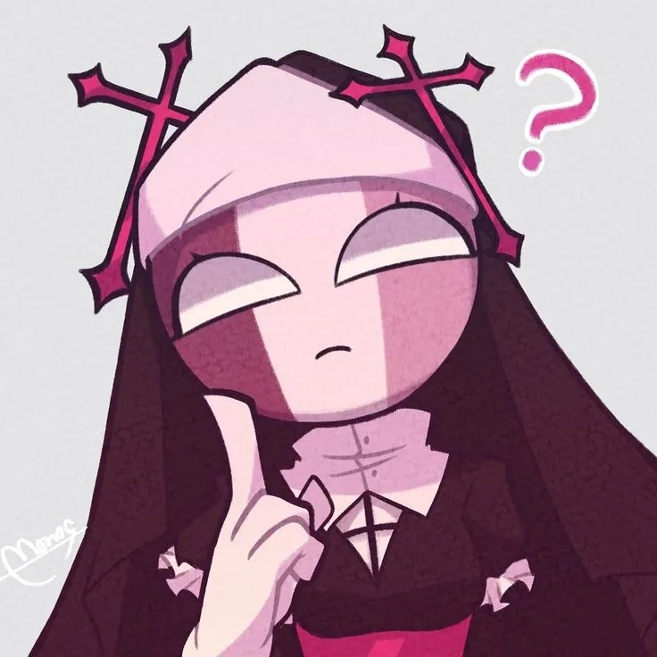

# Redstone Lamp Editor

A **PyQt6-based pixel editor** for making Minecraft-art.

---

## Usage

Run the application with:

```bash
python main.py
```

*(or whatever filename you saved the script as)*

---

## Controls

| Action                          | Description                       |
| ------------------------------- | --------------------------------- |
| Click & drag (Drawing mode) | Turn lamps **on**                                     |
| Click & drag (Erase mode)    | Turn lamps **off**                                   |
| Drawing mode                 | Toggle drawing on/off                                |
| Erase mode                   | Toggle erasing on/off                                |
| Export PNG                   | Save the current grid as a PNG                       |
| Export JSON                  | Save current lamp state as JSON                      |
| Load JSON                    | Load a saved lamp state                              |
| Image → Lamp                 | Convert an image into a lamp grid                    |
| Bucket                       | Bucket tool                                          |
| Clear canvas                 | Clear canvas tool                                    |
| Image → Blocks               | Convert an image into a pixelart of minecraft blocks |

---

## Project Structure

```
redstone-lamp-editor/
│
├── lamp_editor.py
├── requirements.txt
├── Blocks/
  └── Red_wool
  └── Etc...
├── Redstone_lamp.png
├── Redstone_lamp_on.png
└── README.md

```

---

## Platforms Supported

| Platform   | Supported |
| ---------- | --------- |
| Windows | ✅         |
| macOS   | ✅         |
| Linux   | ✅         |

---

## License

This project is free to use and modify for personal or educational purposes.
Credits are appreciated if you share or modify the project.

---

## Credits

This project was inspired by [mattbatwings](https://github.com/mattbatwings),
who created [lampsim](https://github.com/mattbatwings/lampsim) — a Redstone lamp simulator for Minecraft.

## How to export world

Press the export world button and save the zip file as you like. Now unzip the file and place the folder in  
**windows:** %APPDATA%\.minecraft\saves  
**mac:** ~/Library/Application Support/minecraft/saves  
**linux:** ~/.minecraft/saves  
Now you can open your world in any version that is 1.18.1 or higher and the pixelart should be there.
**Note:** The game will say it may be incompatible but you can ignore that.

## How to modify blocks
You can add more blocks by putting .png files in the blocks folder. The program will automaticly use them for both the preview and world. **Disclaimer!!** If you add blocks with names that are not in the game files, that are entities, or that are added after 1.18.1, the export world option wont work.

## Examples





